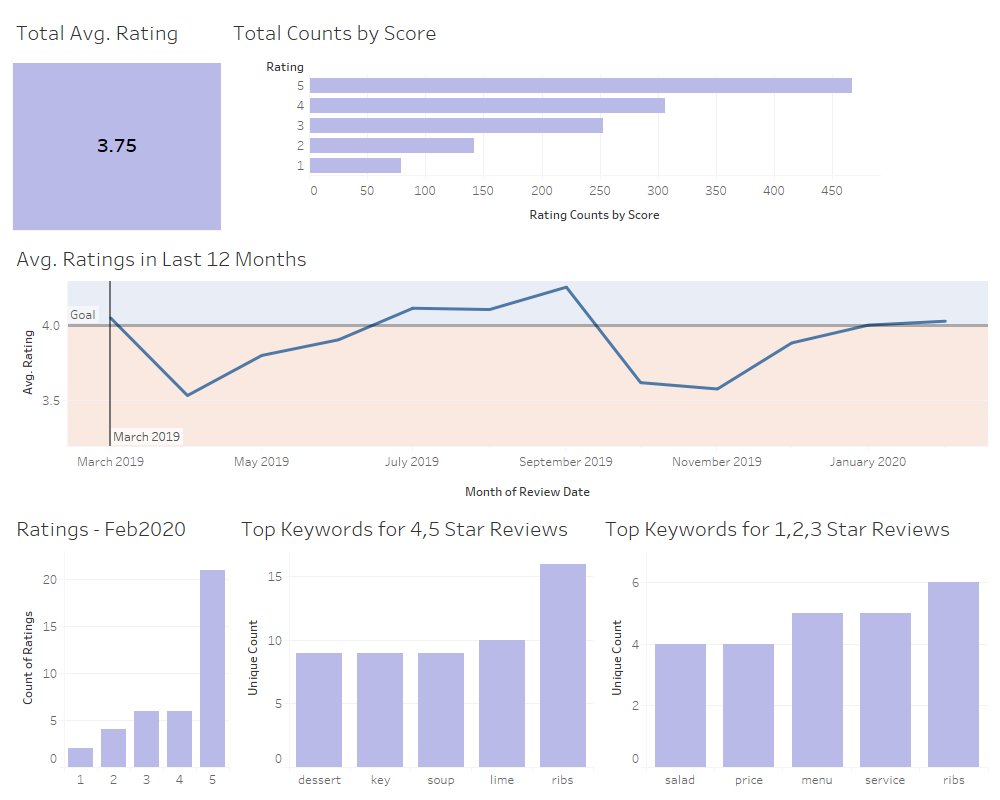

# Restaurant Review Dashboard

## Summary
Because restaurants are a customer service business, insights in how a restaurant is performing can be gained by observing customer sentiments in online reviews. Reviews for a restaurant were scraped off the web using Python's scrapy, processed to show meaningful information, and displayed in a Tableau dashboard. The dashboard is able to clearly show recent monthly performance in terms of customer ratings as well as common keywords in their reviews all in one place.

## Overview and Data
Customer sentiments toward a restaurant are highly indicative of the quality of service a restaurant provides. It is common for potential customers to screen out restaurants they want to dine at due to subpar online reviews. Because of this, many restaurants should pay attention to how their customers have been feeling about their business to know if it is achieving the standard goal of 4 out of 5 points on average in online reviews.

To determine areas that are (or are not) working, restaurant businesses can make use of the text reviews that customers write. For example, if several poor ratings have the word service in their reviews, the business owner can know to take steps to improve the quality of service to his or her customers. Additionally, keywords in positive reviews can highlight what the restaurant is doing well.

Because understanding how a restaurant is doing in terms of ratings and knowing what customers are saying about the restaurant are highly related, it makes sense to display this information in a dashboard where they can be seen together. This project utilizes Tableau's dashboarding software to highlight recent customer feelings toward Michael Mina's and Ayesha Curry's International Smoke and areas the restaurant can improve in.

Rating and review data were scraped off the web using Python's scrapy framework, reviews were processed to obtain keywords, and the information was displayed in a Tableau dashboard. Keyword counts are the unique counts for each review. This means that if a unique keyword count shows as 6, the keyword appeared in 6 reviews. This prevents inflating a keyword count by a review that mentions a specific keyword multiple times. 

## Tools Used
Python was used to obtain the data and process it. More specifically, the scrapy framework in Python was used to collect the data from the internet and create data pipelines into a PostgreSQL database. The pandas and NLTK libraries were used to process the reviews to find keywords in them. Tableau Desktop was utilized to create a dashboard of the information.

## Results
It was found that in recent months, the restaurant has been doing well in terms of customer ratings. Average ratings for January and February were both at least 4 out of 5. Because of this, it is clear to see that a large number of reviews are above 3 in the bar chart in the bottom left. The keywords bar chart in the middle bottom of the dashboard show that soup, dessert, key, lime, and ribs were common words in reviews that gave the restaurant at least 4 stars in the month of February. Knowing the menu, this highlights the success of their Tom Kha Soup, desserts (and specifically key lime pie), and their ribs/korean short ribs. The keywords bar chart in the bottom right shows keyword counts in poor reviews (scores of 3 or less). Salad, price, menu, service, and ribs are shown as common words in the 12 reviews with ratings of 3 or less. In terms of food, unsatisfied customers could have felt the salad was lacking in quality and the menu selection was not good. Ribs are shown as a keyword in both the positive and negative reviews. This could be a sign of the ribs/short ribs being hyped up and some customers feeling that the food did not live up to the hype. Because price and service show up as a negative keyword, unsatisfied customers could have felt that the food was expensive and that service was poor. To utilize this information to improve the restaurant, extra training to improve service can be done to have more consistent good service for more customers.

## Author(s)

* **Dexter Luu**

 

[Go back to the main project page](https://dexkluu.github.io/Dexter/)
